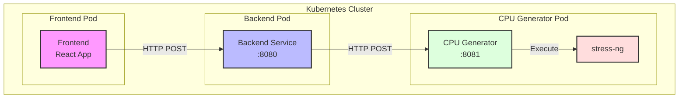

# Kubernetes Load Generator

쿠버네티스 환경에서 시스템 부하를 생성하고 모니터링하기 위한 테스트 도구입니다.

## 프로젝트 개요

이 프로젝트는 쿠버네티스 클러스터에서 다양한 유형의 시스템 부하를 생성하고 관리하기 위한 도구입니다. 현재는 CPU 부하 생성 기능이 구현되어 있으며, 향후 메모리 및 네트워크 부하 테스트 기능이 추가될 예정입니다.

### 주요 기능

- CPU 부하 생성 및 제어
- 실시간 상태 모니터링
- 웹 기반 사용자 인터페이스
- 쿠버네티스 네이티브 배포

## 시스템 아키텍처



시스템은 세 개의 주요 컴포넌트로 구성되어 있습니다:

1. **Frontend (React)**
   - 사용자 인터페이스 제공
   - 부하 테스트 제어
   - 실시간 상태 표시

2. **Backend (Go/Gin)**
   - API 엔드포인트 제공
   - 부하 생성 서비스와 통신
   - CORS 및 보안 처리

3. **CPU Generator (Go)**
   - stress-ng를 통한 CPU 부하 생성
   - 부하 수준 제어
   - 프로세스 관리

## 기술 스택

- Frontend: React, TypeScript, Axios
- Backend: Go 1.22, Gin Framework
- Infrastructure: Kubernetes
- Load Generation: stress-ng

## 설치 및 배포

### 사전 요구사항

- Kubernetes 클러스터
- kubectl CLI 도구
- 도커 레지스트리 접근 권한

### 배포 방법

1. 네임스페이스 생성 및 리소스 배포:
```bash
kubectl apply -f manifest.yaml
```

2. 서비스 상태 확인:
```bash
kubectl get all -n load-tester
```

## 사용 방법

1. Frontend 서비스의 External IP 확인:
```bash
kubectl get svc frontend -n load-tester
```

2. 웹 브라우저에서 접속하여 사용:
   - CPU 부하 테스트 시작/중지
   - 상태 모니터링

## 리소스 요구사항

각 컴포넌트의 리소스 요구사항은 다음과 같습니다:

- Frontend: CPU 100m, Memory 64Mi
- Backend: CPU 100m, Memory 64Mi
- CPU Generator: CPU 1000m, Memory 128Mi

## 향후 개발 계획

- [ ] 메모리 부하 테스트 기능
- [ ] 네트워크 부하 테스트 기능
- [ ] 상세 모니터링 대시보드
- [ ] 테스트 시나리오 저장 및 재사용
- [ ] 멀티 클러스터 지원

## 문제 해결

일반적인 문제 해결 방법:

1. 파드 상태 확인:
```bash
kubectl get pods -n load-tester
```

2. 로그 확인:
```bash
kubectl logs -f deployment/[component-name] -n load-tester
```

## 기여 방법

1. Fork the repository
2. Create your feature branch
3. Commit your changes
4. Push to the branch
5. Create a new Pull Request

## 라이센스

This project is licensed under the MIT License - see the LICENSE file for details.